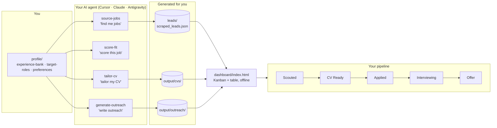

# JobHunter OS


> An AI-powered job search engine that runs entirely inside your code editor. It finds jobs, scores them against your experience, tailors your CV, and drafts your outreach.

Instead of paying for a SaaS subscription, JobHunter OS is a template repository. You open it in an AI IDE (like Cursor or Claude Code), fill out your profile once, and simply **talk to the agent**.

The AI agent is the engine. The dashboard is your UI. All data stays local on your machine.

---

## 🎬 See it in action


Every command above is just you talking — the agent reads your `profile/`, runs the matching skill, and writes the result to a file the dashboard already knows how to show.

---

## 🗺️ How it works



No server, no database — files are the contract between the agent and the dashboard.

---

## 🖥️ The dashboard


*(Sample data shown — yours starts empty and fills up as you use the agent.)*

---

## ⚡ The 3-Step Setup

### Step 1: Get this repo
Download the ZIP of this repository and extract it to a folder on your computer.

### Step 2: Open in your AI IDE
We recommend **Cursor** (free, cursor.com), but Claude (Cowork) and Antigravity also work perfectly.
1. Install Cursor and open it.
2. Go to **File → Open Folder...** and select the folder you just extracted.
3. Open the **Chat** panel on the right.

### Step 3: Type the magic words
In the chat panel, simply type:
```
Let's get started
```
Your AI assistant will introduce itself, ask a few questions to build your profile, and guide you on how to find jobs and tailor your CV.

---

## 🧭 Navigating the System

- **Dashboard**: Double-click `dashboard/index.html` to open your offline Kanban board. Track your applications, scouted roles, and interviews here. No login required.
- **Profile (`profile/`)**: This holds your target roles, experience bank, and preferences. The agent reads this to tailor your CVs and find matching jobs.
- **Skills (`skills/`)**: The brains of the operation. These markdown files contain the exact prompts and steps the agent follows when you ask it to "find jobs" or "tailor my CV". Editing these files changes the agent's behavior.
- **Outputs (`output/` & `leads/`)**: The agent saves tailored CVs, cover letters, and scraped job leads into these folders.

## ✨ Capabilities

Once set up, you can ask your agent to:
- **"Find me jobs"** → Scrapes matching roles and saves them to your dashboard.
- **"Score this job"** → Reads a JD and scores your fit (0-100) based on your experience bank.
- **"Tailor my CV"** → Rewrites your CV to specifically target a role you've found.
- **"Write outreach"** → Drafts a personalized cover letter and LinkedIn DM sequence for the hiring manager.

---

*Note: Sync your skills editing in `/skills` as the source of truth across any IDE you use.*

Built by **Afsal Ali** — AI-Ops & Automation.
[LinkedIn](https://linkedin.com/in/your-handle) · MIT Licensed
