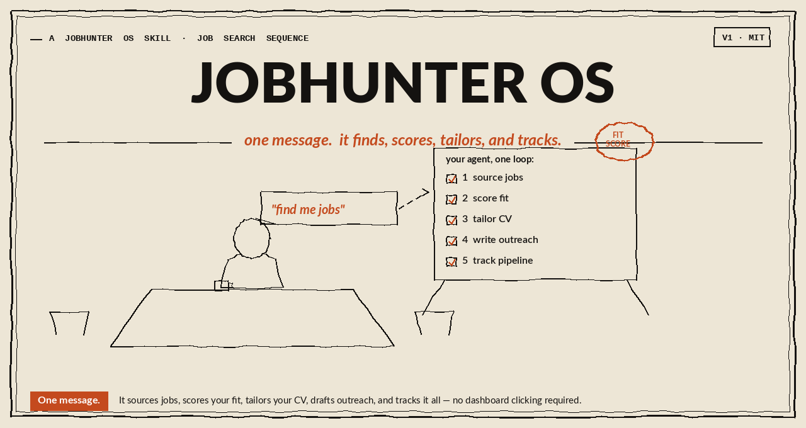
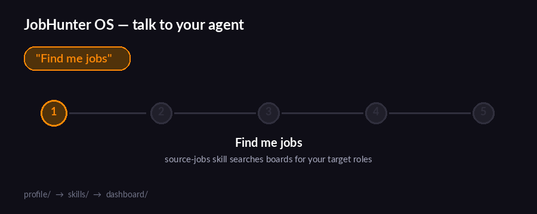
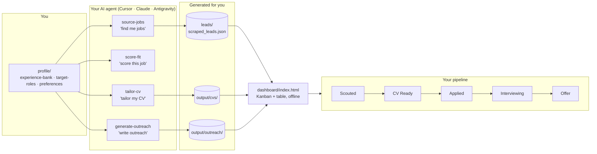
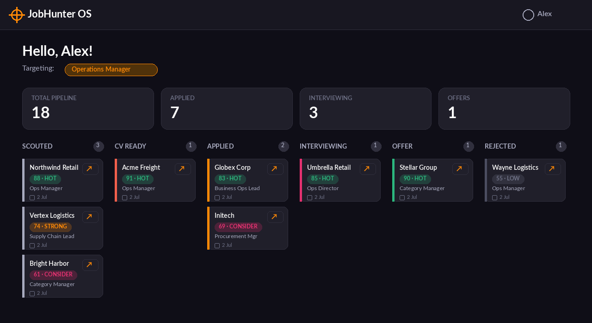

# JobHunter OS



> An AI-powered job search engine that runs entirely inside your code editor. It finds jobs, scores them against your experience, tailors your CV, and drafts your outreach.

Instead of paying for a SaaS subscription, JobHunter OS is a template repository. You open it in an AI IDE (like Cursor or Claude Code), build your profile from your **real CV and LinkedIn** once, and simply **talk to the agent**.

The AI agent is the engine. The dashboard is your UI. All data stays local on your machine.

> **No fabricated listings, ever.** Every job the agent adds to your pipeline is a real posting it actually found — real company, real link — never a placeholder or a guess. If it can't access the web or a site in your environment, it tells you instead of making something up. Same goes for fit scores (based on the actual job description, not a guess from the title) and CVs (built only from what's really in your profile).

---

## 🏆 Why JobHunter OS? (Key Strengths)

- **Privacy-First & Offline**: Keeping all your career history locally means you aren't feeding PII into a third-party SaaS platform. The dashboard runs completely offline via `localStorage`.
- **Genuinely ATS-Safe CV Generator**: Most AI wrappers generate resumes that fail Workday or Greenhouse parsers. Our bundled `build_ats_docx.py` script enforces strict ATS rules (no tables, single column, standard fonts) programmatically.
- **Concrete Scoring Rubric**: Instead of random guesswork, the explicit 100-point rubric forces the AI to show its math (Core Skills, Experience, Industry, etc.), making the "Fit Score" actionable.
- **Dual-Track Tracking**: We offer both a gorgeous HTML Kanban dashboard and a native Excel spreadsheet (`JobHunter_Pipeline.xlsx`). Our sync script intelligently bridges the gap so you can use whichever tool you prefer without breaking formulas.
- **AI as an Assistant, Not a Replacement**: The system explicitly forces the AI to read *real* job descriptions and forbids fabricating experience. No AI hallucination traps.

---

## 🎬 See it in action



Every command above is just you talking — the agent reads your `profile/`, runs the matching skill, and writes the result to a file the dashboard already knows how to show.

---

## 🗺️ How it works



No server, no database — files are the contract between the agent and the dashboard.

---

## 🖥️ The dashboard



Every card shows its **fit score** (banded: ≥80 HOT, 70-79 Strong, 60-69 Consider, <60 Low — set by the `score-fit` / `source-jobs` skills) and a one-click **Apply** button that opens the job link and then asks you to confirm whether the application went through, auto-moving the card to "Applied".

*(Sample data shown — yours starts empty and fills up as you use the agent.)*

---

## 📊 Prefer a spreadsheet?

`excel/JobHunter_Pipeline.xlsx` is a companion to the HTML dashboard for anyone who'd rather work in Excel. One file, two tabs:

- **Pipeline** — the same fields as the dashboard (company, role, fit score, band, status, applied date, job URL), pre-formatted as a table with filters and color-coded score/status bands.
- **Dashboard** — KPI cards (Total Pipeline, Applied, Interviewing, Offers) plus a status bar chart and a fit-score pie chart, all driven by formulas that recalculate as you add rows to Pipeline. No manual updating.

Ships empty, same as the dashboard — no sample rows to clear out. Just tell your agent "find me jobs and put them in the Excel file" and it appends real leads straight into the Pipeline table (alongside `leads/scraped_leads.json`, so both stay in sync).

---

## ⚡ The 3-Step Setup

### Step 1: Get this repo
Download the ZIP of this repository and extract it to a folder on your computer.

### Step 2: Open in your AI IDE
This works in any AI coding tool, though how well each one auto-discovers the skills varies:
- **Claude Code / Cowork** — native skill discovery via `.claude/skills/`, the strongest support.
- **Cursor** — native rule discovery via `.cursor/rules/*.mdc`, also fully wired up.
- **Antigravity** or anything else — reads `AGENTS.md` and `skills/` directly; if your tool
  doesn't pick these up on its own, just tell it to "read AGENTS.md and follow the skills in
  `skills/`" once at the start.

We recommend **Cursor** (free, cursor.com) if you don't already have a preference:
1. Install Cursor and open it.
2. Go to **File → Open Folder...** and select the folder you just extracted.
3. Open the **Chat** panel on the right.

### Step 3: Type the magic words
In the chat panel, simply type:
```
Let's get started
```
Your AI assistant will introduce itself and ask you to upload your CV, paste your LinkedIn profile, or share any other real material — it builds your profile from that (never invents experience), then asks where you're job hunting (job sites are regional) before showing you how to find jobs and tailor your CV.

---

## 🧭 Navigating the System

- **Dashboard**: Double-click `dashboard/index.html` to open your offline Kanban board. Track your applications, scouted roles, and interviews here. No login required.
- **Excel (`excel/`)**: The `JobHunter_Pipeline.xlsx` spreadsheet for those who prefer native tables. Includes `add_lead.py` to seamlessly sync leads from the AI.
- **Profile (`profile/`)**: This holds your target roles, experience bank, and preferences. The agent reads this to tailor your CVs and find matching jobs.
- **Skills (`skills/`)**: The brains of the operation. These markdown files contain the exact prompts and steps the agent follows when you ask it to "find jobs" or "tailor my CV". Editing these files changes the agent's behavior.
- **Scripts (`scripts/`)**: Core automation scripts, like `build_ats_docx.py`, which enforce deterministic formatting rules (like ATS compliance) so the AI doesn't have to guess.
- **Outputs (`output/` & `leads/`)**: The agent saves tailored CVs, cover letters, and scraped job leads into these folders.

## ✨ Capabilities

Once set up, you can ask your agent to:
- **"Find me jobs"** → Searches real job boards for your region (web search first, falling back to actually browsing LinkedIn/regional sites if needed) and saves real, live postings to your dashboard — never fabricated.
- **"Score this job"** → Opens the actual JD and scores your fit (0-100) based on your real experience bank — never guesses from a title alone.
- **"Tailor my CV"** → Rewrites your CV to specifically target a role you've found, using only what's genuinely in your profile, and outputs a genuinely ATS-safe `.docx` (single column, no tables/graphics, standard fonts and section headings, JD-keyword mirrored) plus an editable Markdown draft — not just something that looks good, something that actually parses cleanly in applicant tracking systems.
- **"Write outreach"** → Drafts a personalized cover letter and LinkedIn DM sequence for the hiring manager.

---

*Note: Sync your skills editing in `/skills` as the source of truth across any IDE you use.*

See [CHANGELOG.md](CHANGELOG.md) for release history.

MIT Licensed
